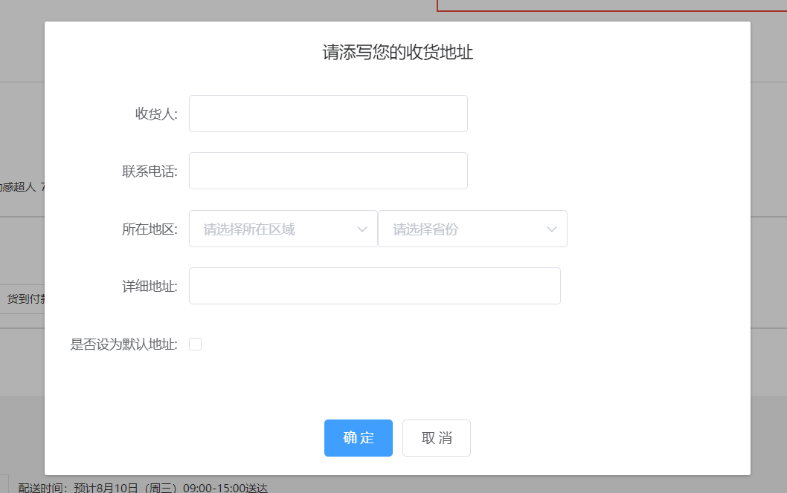
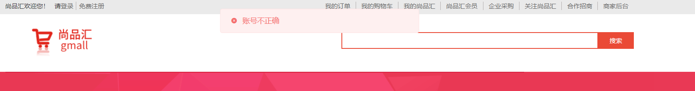
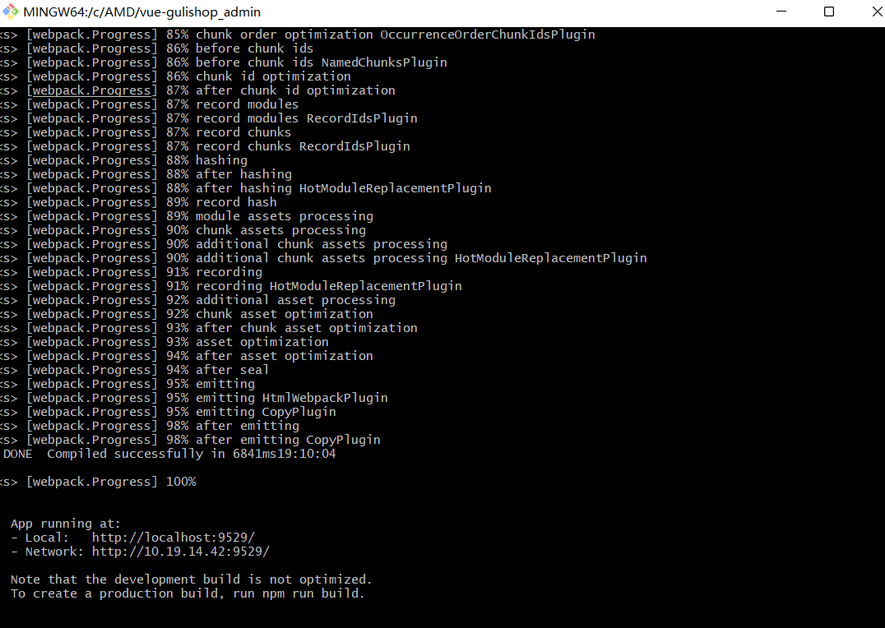

## 尚品汇前台练习

* 在线地址演示1(前台项目)
  * http://demo.gshopfront.dreamlove.top/


### 重新添加了修改了下

* 2022年7月30日16.13.13

1. 登录界面添加了下自动登录
2. detail购物车用户输入商品数量的优化,为合法值的时候才更新,否者还原原有的值  
3. 搜索结果页面的评价人数用随机数,这样子好看点,并且每一件商品的金额的样式调整了下
4. 事件委派的方式为搜索结果添加'加入购物车'按钮
5. 结算页面验证是否登录了 
6. 首页swiper的前进后退按钮移入显示移出隐藏
7. login界面的label和input对齐了下
8. 注册成功后自动登录
9. 地址编辑框优化
10. dialog自己添加遮罩层和dialog显示的时候禁用滚动(elementui在这里有bug)
11. 购物车为空的时候没有什么提示添加进去了一个内容
12. 购物车提交时候必须要有地址信息才可以
13. 注册界面添加倒计时
14. 提交订单页选择优化
15. 购物车列表商品增加删除逻辑优化
16. 一些样式的轻微调整
17. **其他的请你们进入在线演示仔细查看吧~**

### 自己添加了下收货地址和删除收货地址



### 有时候主页的一些数据老是获取不到,用了假数据(但是数据内容和接口地址是一样的)


### 添加地址


### 信息弹窗全部改为element-ui的message提示





### 项目依赖安装

```
npm install
```

### 项目运行
```
npm run serve
```

### 项目打包编译
```
npm run build
```

### 地址

#### 国外
```
https://github.com/superBiuBiuMan/gshop_project
```
#### 国内
```
https://gitee.com/superBiuBiu/gshop_project
```

## 尚品汇后台练习

* 在线演示(后台项目): http://demo.gshopback.dreamlove.top
  


### 首页登录


### 首页图表


### 品牌管理


### 权限管理


### 商品管理


### 项目依赖安装

```
npm install
```

### 项目运行
```
npm run dev
```

### 项目打包编译
```
//构建生产环境
npm run build:prod
//构成测试环境
npm run build:stage
```

#### 如果想在nginx上线,注意配置转发和删除.env.production的里面的内容(以生产环境打包为例)

* 需要删除Vue_APP_BASE_API里面的内容~


* nginx转发设置

  

### 地址

#### 国外
```
https://github.com/superBiuBiuMan/gshop_project_after
```
#### 国内
```
https://gitee.com/superBiuBiu/gshop_project_after
```

#### 如果角色权限不能正常赋予请看这里

* elementUI tree在收集数据的时候,并不会在上几级的数据放入,所以会导致用户权限不能正常赋予,这里给出了解决办法

```javascript
vue elementUI tree树形控件获取父节点ID的实例

修改源码:
情况1: element-ui没有实现按需引入打包
  node_modules\element-ui\lib\element-ui.common.js    25382行修改源码  去掉 'includeHalfChecked &&'
  // if ((child.checked || includeHalfChecked && child.indeterminate) && (!leafOnly || leafOnly && child.isLeaf)) {
  if ((child.checked || child.indeterminate) && (!leafOnly || leafOnly && child.isLeaf)) {

      
情况2: element-ui实现了按需引入打包
  node_modules\element-ui\lib\tree.js    1051行修改源码  去掉 'includeHalfChecked &&'
  // if ((child.checked || includeHalfChecked && child.indeterminate) && (!leafOnly || leafOnly && child.isLeaf)) {
  if ((child.checked || child.indeterminate) && (!leafOnly || leafOnly && child.isLeaf)) {

```

## 注意!!!!!!!!!

* **vue-admin管理模板npm安装依赖后npm run de提示依赖core-js,@babel等报错的解决办法**

### 安装别人做好的后台管理项目,npm run dev后报错

* 都是这种`core-js/modules/es.array.concat.js `什么的错误


### 解决

1. 找到项目下的babel.config.js **原来的presets改为下面**

   ```javascript
   presets: [ [ "@vue/app", { useBuiltIns: "entry" } ] ],
   ```

2. 改好之后


3. 重新运行`npm run dev` 成功!

   